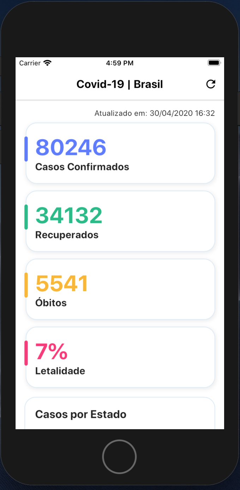
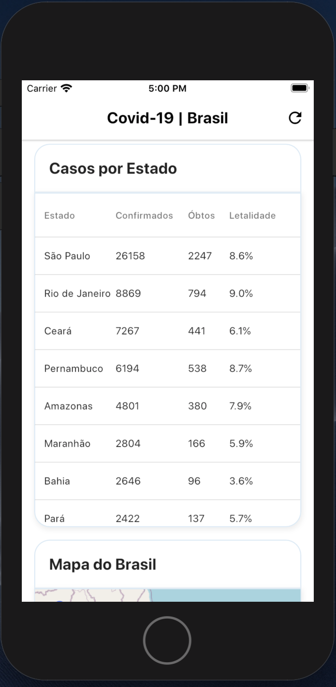
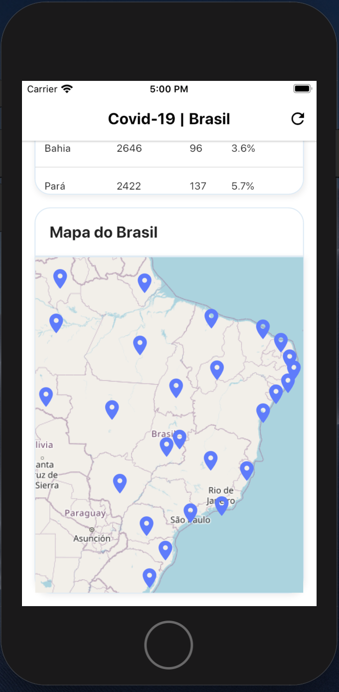

# Flutter APP Covid-19 With Tests

|                             |                             |                             |
| :-------------------------- | :-------------------------: | :-------------------------: |
|  |  |  |
|                             |                             |                             |

Um aplicativo simples feito em flutter utilizando MobX, Modular, Slidy, Mockito etc. Este App tem o íntuito de ajudar (eu inclusive) quem está iniciando a aplicar testes em seus aplicativos e para mostrar a importância de ficar em casa.

## Roadmap

| Teste      | Progresso |
| :--------- | :-------: |
| Unitários  |    ✅     |
| Widgets    |    ☑️     |
| Integração |    ☑️     |

## Pacotes e API:

- [MobX](https://github.com/mobxjs/mobx.dart) para gerenciamento de estado.
- [Modular](https://pub.dev/packages/flutter_modular) para arquitetura, injeção de dependências, controle de rotas etc.
- [Slidy](https://pub.dev/packages/slidy) CLI para gerenciamento de pacotes e gerador de template.
- [Mockito](https://pub.dev/packages/mockito) para mockar comportamentos faciliando os testes unitários.
- [Dio](https://github.com/flutterchina/dio) para requisição http.
- [API](https://github.com/devarthurribeiro/covid19-brazil-api) para consulta dos dados.
